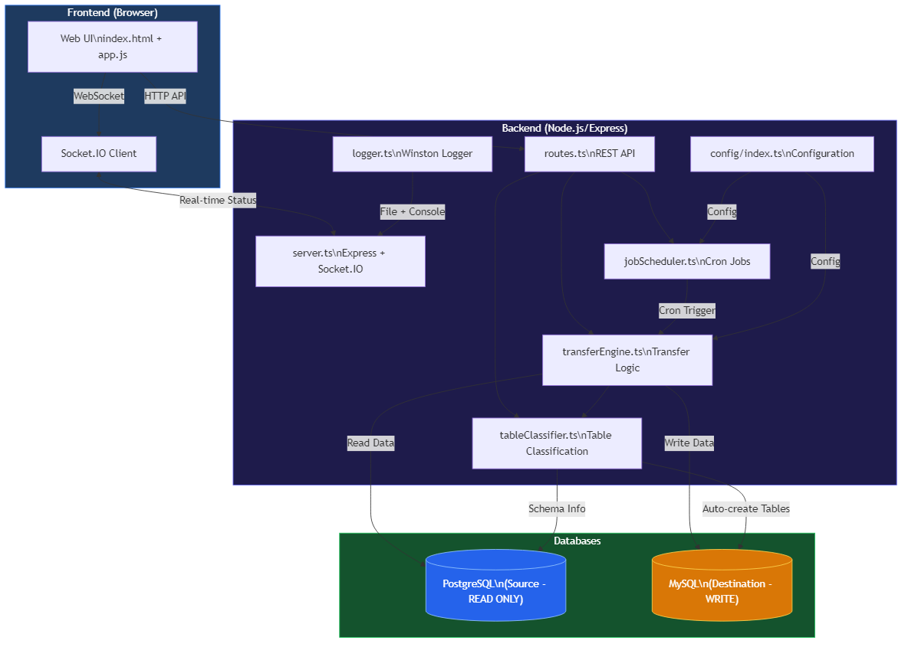
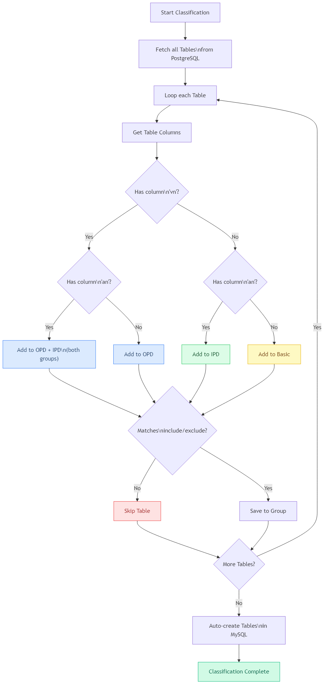
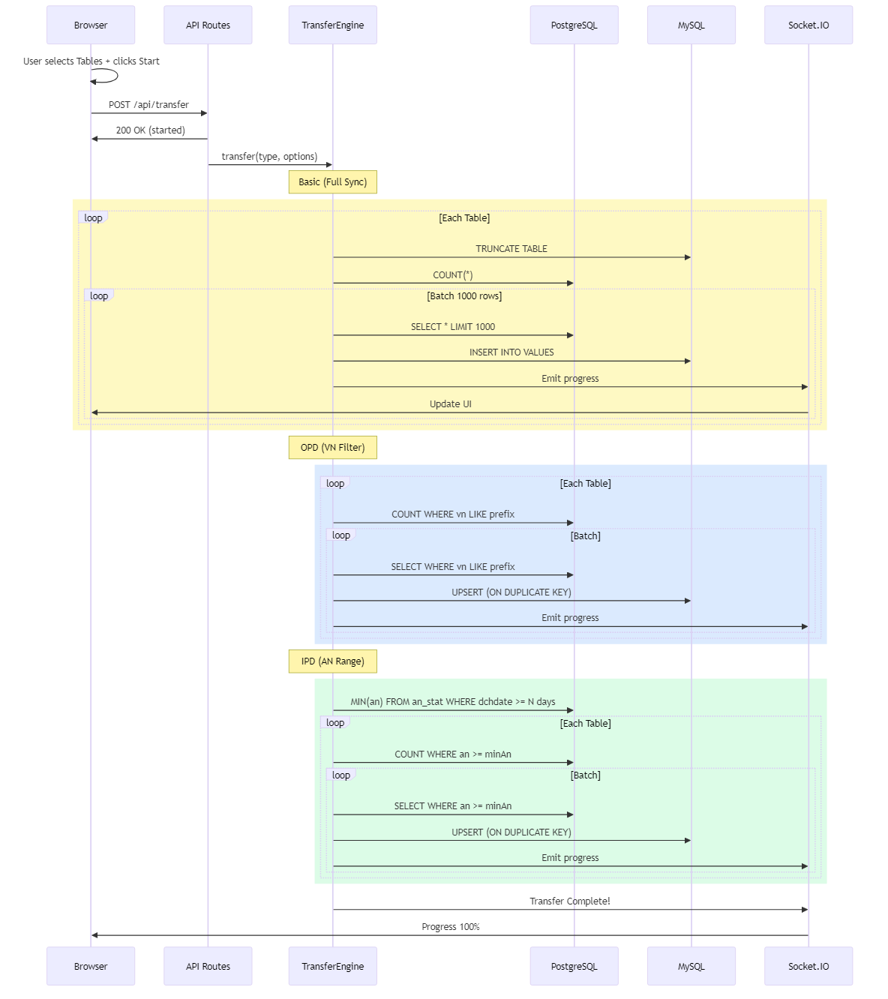
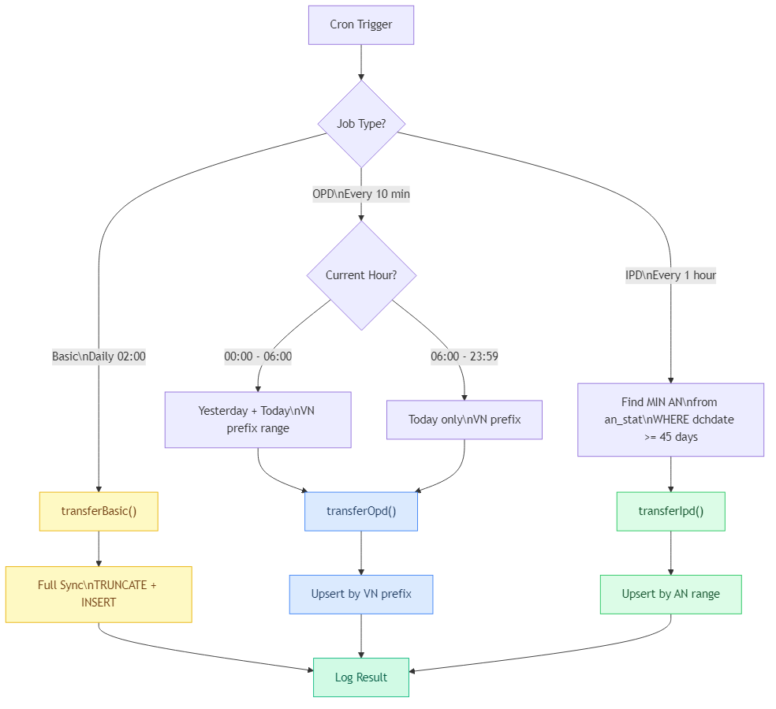
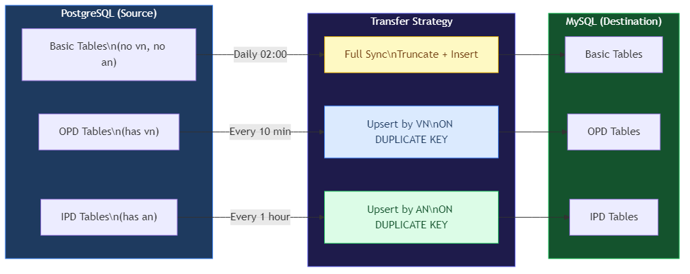

# System Flow: PostgreSQL to MySQL Data Transfer

## Architecture Overview



---

## 1. Table Classification Flow

ระบบแบ่งตารางอัตโนมัติตาม column ที่มีในตาราง:

| Column ที่พบ | ประเภท | คำอธิบาย |
|-------------|--------|----------|
| ไม่มี vn, an | **Basic** | ตารางพื้นฐาน |
| มี vn | **OPD** | ข้อมูลผู้ป่วยนอก |
| มี an | **IPD** | ข้อมูลผู้ป่วยใน |
| มีทั้ง vn + an | **OPD + IPD** | อยู่ทั้ง 2 กลุ่ม |



---

## 2. Manual Transfer Flow

เมื่อ User กดปุ่ม Start Transfer ผ่าน Web UI:



---

## 3. Scheduler Auto-Transfer Flow

Cron Jobs อัตโนมัติ 3 ชนิด:

| Job | Schedule | Strategy |
|-----|----------|----------|
| **Basic** | ทุกวัน 02:00 | Full Sync (TRUNCATE + INSERT) |
| **OPD** | ทุก 10 นาที | Upsert by VN prefix |
| **IPD** | ทุก 1 ชั่วโมง | Upsert by AN range (45 วัน) |



---

## 4. Data Flow Summary



---

## VN / AN Format Reference

| Field | Format | Example | Description |
|-------|--------|---------|-------------|
| VN | `YYMMDD...` | `680225...` | พ.ศ. 2568 → 68, เดือน 02, วันที่ 25 |
| AN | `YY...` | `68...` | Buddhist Year prefix |
| dchdate | `DATE` | `2026-02-25` | วันจำหน่าย (Discharge date) |

---

## Transfer Strategies

### Basic (Full Sync)
```
1. TRUNCATE ตารางปลายทาง (MySQL)
2. COUNT(*) จากต้นทาง (PostgreSQL)
3. Loop: SELECT * LIMIT 1000 OFFSET n
4. INSERT INTO ... VALUES (batch insert)
5. วนจน OFFSET >= totalRows
```

### OPD (Upsert by VN)
```
1. สร้าง VN prefix: พ.ศ. (2 หลัก) + เดือน (2 หลัก) + วัน (2 หลัก)
   เช่น วันที่ 25/02/2568 → prefix = "680225"
2. COUNT WHERE vn LIKE '680225%'
3. Loop: SELECT WHERE vn LIKE '680225%' LIMIT 1000
4. INSERT ON DUPLICATE KEY UPDATE (upsert)
```

### IPD (Upsert by AN Range)
```
1. หา MIN(an) จาก an_stat WHERE dchdate >= 45 วันย้อนหลัง
2. COUNT WHERE an >= minAn
3. Loop: SELECT WHERE an >= minAn LIMIT 1000
4. INSERT ON DUPLICATE KEY UPDATE (upsert)
```
